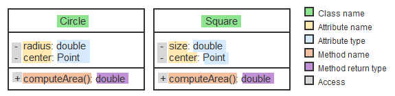
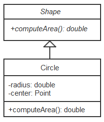
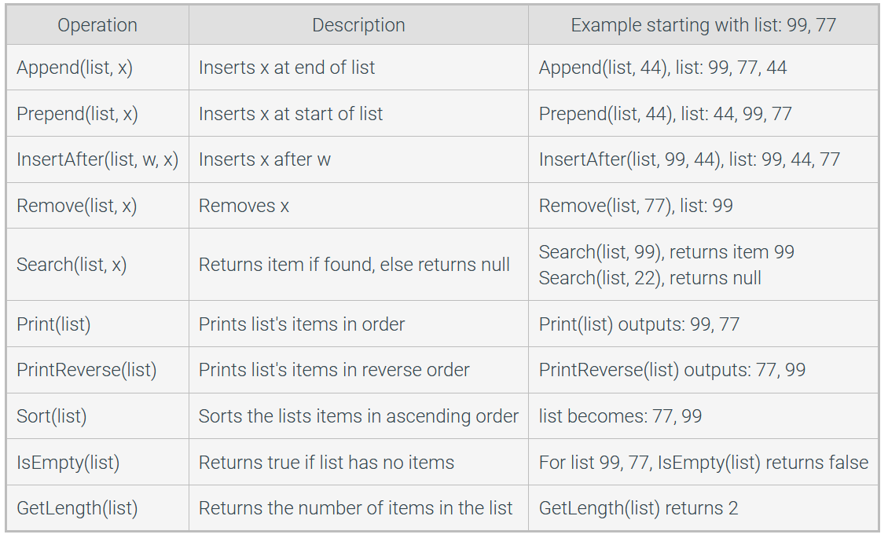

# Intro
- data structures store data
- algorithms solve problems using that data
- final is not cumulative

- if you print an object without a toString function it will print the memory address
- the no-parameter constructor is defined, but if you define one with parameters then it stops working and you have to write your own
- recall java arrays need to have all the same data types
- in a for loop
  - `i++` means the loop body will run with i and add the 1 after it finishes
  - `++i` means the loop body will run with i+1 immediately
- overriding: replacing methods from a parent class
- overloading: macing multiple of the same function with different functionality for different types/amounts of arguments

# Access Modifiers
the different types of access modifiers:
- a class can only be `public` or `package-private` (no modifier). 
  - `public` is visible to all other classes anywhere. 
  - no modifier is only visible to classes in the same package.
- members can be any of these:
  - `public` is visible to all other classes anywhere. 
  - no modifier is only visible to classes in the same package.
  - `private` can only be accessed in its own class 
  - `protected` can only be accessed within its own package AND by a subclass of its class, even if it is in a different package
| Modifier                        | Self | Other classes, same pkg | Subclass, same pkg | Subclass, diff. pkg | Anywhere |
| ------------------------------- | ---- | ----------------------- | ------------------ | ------------------- | -------- |
| `public`                        | Y    | Y                       | Y                  | Y                   | Y        |
| `protected`                     | Y    | Y                       | Y                  | N                   | N        |
| no modifier/ `package-private` | Y    | Y                       | N                  | N                   | N        |
| `private`                       | Y    | N                       | N                  | N                   | N        |
mostly from the [oracle tutorial](https://docs.oracle.com/javase/tutorial/java/javaOO/accesscontrol.html)

- Java doesn't support restricting access by instance, only by class.
  - A class's methods are allowed to access private members of other objects of the same class. More precisely, a method of class C can access private members of C on objects of any subclass of C.
- having a `private`, `package-private`, or `protected` constructor means only code within the class can instantiate the class. 
  - this also means it cannot be subclassed unless the subclass is nested within the original class.

# Polymorphism
- because Java supports *derived/base class reference conversion*, when you reference a member of a subclass, you can treat it like a member of it's base class.
  - because of this, you can have an array made up of different objects, as long as they're in different subclasses of the same class
    - perhaps make an `ArrayList` of `Object`s and put basically anything besides literals in it
  - if you iterate along all of the objects and call a method that the base class has, the JVM will run the subclass's overridden version or, if they don't override it, will use the base class's version of it.
    - you must call a method defined in the base class the list was made for

# Types of classes
## Abstract classes
- an `abstract` method is not implemented in the base class -- all derived classes must override the function.
  - precedes the method signature: `abstract double computeArea(){...}`
    - you can't also put an access modifier because it cannot be used anyway
  - any class with an abstract method must be abstract, but abstract class can contain both abstract and concrete methods.
- an `abstract` class cannot be instantiated, but is strictly a superclass that specifies how its subclass/es must be implemented.
  - `public abstract class Shape {`
  - can have regular and abstract methods. derived classes need not override concrete functions (but they can).
  - can have a constructor, even if it can't be instantiated
- a concrete class is a regular class
  - if a concrete class doesn't override an abstract method from its base class, it cannot be instantiated.

## Interfaces
- like an abstract class but ***only*** contains abstract methods and `static final` fields
  - because they only contain abstract methods you don't actually need to include  `abstract` in their signatures
  - this means you can specify access modifiers for its abstract methods
- defined: `public interface MyInterface {...}`
- inhereted with `implements` rather than `extends`
- you can *implement* as many interfaces as you want with a comma-separated list: `public class Square implements Shape, DisplayObject,  {...}`
- cannot include a constructor

# is-a / has-a
- is-a: a member of a derived class IS-A member of its base class.
  - child IS-A person.
- has-a: an object HAS-A instance variable.
  - child HAS-A birth date.

## UML outline
Unified Modeling language

regular concrete class:
|ClassName|
|--|
|-privateDataMember: Type +publicDataMember: Type #protectedDataMember: Type|
|-privateMethod(): ReturnType +publicMethod(): ReturnType #protectedMethod(): ReturnType|
UML class diagram:

- strictly a structural diagram, not behavioral
  - simplified versions showing just class names may be used for illustrative purposes
- A solid line with a closed, unfilled arrowhead indicates a class is derived from another class.
- the derived class only shows new members
- an abstract class's name and abstract methods must be *italicized*
  - its derived classes should include the method, in regular font, now that it is concrete

  
- interfaces are denoted by putting `<<interface>>` on top of their name
  - all regular type
  - any classes that inherit it point a dashed line with an unfilled arrow at it.
    - also just repeat all of the interface's methods in the derived class bc now they're concrete

# List ADT
- basically the platonic ideal of a List in programming
- the point of this data type is that the implementation is unknown

- singly-linked lists are where each node (i.e. element/cell) links to the one in front of and behind it, and no others.
  - if something points to *null*, it is pointing to nothing.
- the head node is the first one. awesome.
- the tail node is the last one.
## ListRemoveAfter
- `ListRemoveAfter(list, null)`: trying to remove the node after `null` node removes the head of the list instead.
- `ListRemoveAfter` will set `sucNode` to whatever node comes after the node being removed
## idk what this notation is called
- list⇢head = 9 assigns 9 as the head of the list, replacing the original.
- list⇢tail = 9 sets 9 as the last node in the list, replacing the new one.
- list⇢tail⇢next = 9 assigns 9 as the new last node in the list, i.e. what comes after what was the last one
## Linked list search
- returns the first node from the list witht he value you input, including its original pointer (even if it's null)
  - nodes visited = how many nodes come before the correct one *plus the correct one*
- if there is none, it returns null.
 - nodes visited = amoutn of nodes in the list
-  