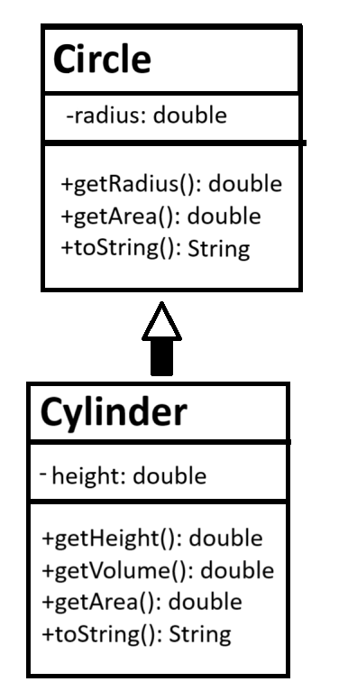
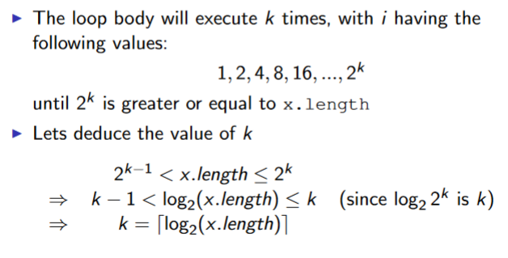
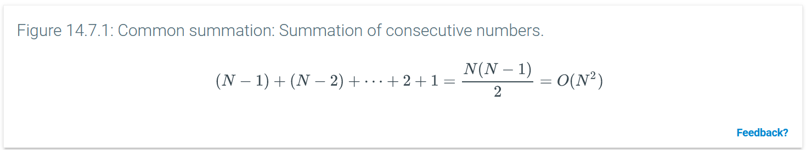
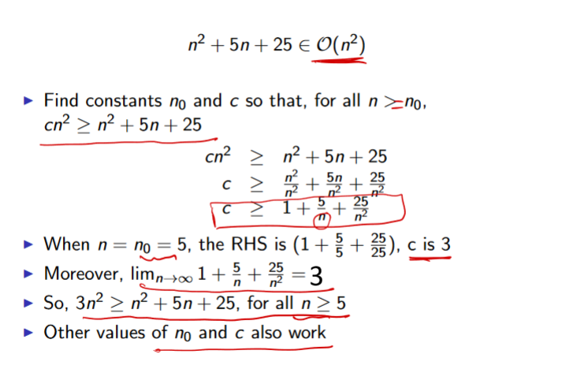

# Intro
- data structures store data
- algorithms solve problems using that data
- final is not cumulative

- if you print an object without a toString function it will print the memory address
- the no-parameter constructor is defined, but if you define one with parameters then it stops working and you have to write your own
- recall java arrays need to have all the same data types
- in a for loop
  - `i++` means the loop body will run with i and add the 1 after it finishes
  - `++i` means the loop body will run with i+1 immediately
- overriding: replacing methods from a parent class
- overloading: macing multiple of the same function with different functionality for different types/amounts of arguments

# Access Modifiers
the different types of access modifiers:
- a class can only be `public` or `package-private` (no modifier). 
  - `public` is visible to all other classes anywhere. 
  - no modifier is only visible to classes in the same package.
- members can be any of these:
  - `public` is visible to all other classes anywhere. 
  - no modifier is only visible to classes in the same package.
  - `private` can only be accessed in its own class 
  - `protected` can only be accessed within its own package AND by a subclass of its class, even if it is in a different package
| Modifier                          | Self | Other classes,<br>same pkg | Subclass,<br>same pkg | Subclass,<br>diff. pkg | Anywhere |
| --------------------------------- | ---- | -------------------------- | --------------------- | ---------------------- | -------- |
| `public`                          | Y    | Y                          | Y                     | Y                      | Y        |
| `protected`                       | Y    | Y                          | Y                     | N                      | N        |
| no modifier/<br>`package-private` | Y    | Y                          | N                     | N                      | N        |
| `private`                         | Y    | N                          | N                     | N                      | N        |
[oracle tutorial](https://docs.oracle.com/javase/tutorial/java/javaOO/accesscontrol.html)

- Java doesn't support restricting access by instance, only by class.
  - A class's methods are allowed to access private members of other objects of the same class. More precisely, a method of class C can access private members of C on objects of any subclass of C.
- having a `private`, `package-private`, or `protected` constructor means only code within the class can instantiate the class. 
  - this also means it cannot be subclassed unless the subclass is nested within the original class.

# Polymorphism
- because Java supports *derived/base class reference conversion*, when you reference a member of a subclass, you can treat it like a member of it's base class.
  - because of this, you can have an array made up of different objects, as long as they're in different subclasses of the same class
    - perhaps make an `ArrayList` of `Object`s and put basically anything besides literals in it
  - if you iterate along all of the objects and call a method that the base class has, the JVM will run the subclass's overridden version or, if they don't override it, will use the base class's version of it.
    - you must call a method defined in the base class the list was made for
## Mismatching Constructors
Here's an example:



```java
public class main {
    public static void main(String[] args) {
        Circle c1 = new Cylinder(1.1,2.2); // base class object with derived class's constructor. diff. args, no error
        System.out.println(c1.getRadius()); // ok because cylinder's constructor sets radius.
        c1.getHeight(); // Exception thrown. Circle has no method getHeight().
        c1.getVolume(); // Exception thrown. Circle has no method getVolume().
        System.out.println(c1.toString()); // uses Cylinder's toString(), overridden from Circle's.
        System.out.println(c1.getArea()); // uses Cylinder's getArea(), overridden from Circle's.

        Cylinder c2 = new Circle(2.2); // Exception thrown. cannot convert. die.
        
    }
}
```
- this specific type of object can use only methods defined by the base class `Circle`. 
- if you try to call a method that *only* `Cylinder` has, an Exception is thrown.
- `c1` will use `Cylinder`'s methods iff it overrides them; otherwise it will use `Circle`'s definition.
- you cannot instantiate a derived class using the constructor of the base class.

# Types of classes
## Abstract classes
- an `abstract` method is not implemented in the base class -- all derived classes must override the function.
  - precedes the method signature: `abstract double computeArea(){...}`
    - you can't also put an access modifier because it cannot be used anyway
  - any class with an abstract method must be abstract, but abstract class can contain both abstract and concrete methods.
- an `abstract` class cannot be instantiated, but is strictly a superclass that specifies how its subclass/es must be implemented.
  - `public abstract class Shape {`
  - can have regular and abstract methods. derived classes need not override concrete functions (but they can).
  - can have a constructor, even if it can't be instantiated
- a concrete class is a regular class
  - if a concrete class doesn't override an abstract method from its base class, it cannot be instantiated.

## Interfaces
- like an abstract class but ***only*** contains abstract methods and `static final` fields
  - because they only contain abstract methods you don't actually need to include  `abstract` in their signatures
  - this means you can specify access modifiers for its abstract methods
- defined: `public interface MyInterface {...}`
- inherited with `implements` rather than `extends`
- you can *implement* as many interfaces as you want with a comma-separated list: `public class Square implements Shape, DisplayObject,  {...}`
- cannot include a constructor


# is-a / has-a
- is-a: a member of a derived class IS-A member of its base class.
  - child IS-A person.
- has-a: an object HAS-A instance variable.
  - child HAS-A birth date.

## UML outline
Unified Modeling language

regular concrete class:
| ClassName                                                                                     |
| --------------------------------------------------------------------------------------------- |
| -privateDataMember: Type<br>+publicDataMember: Type<br>#protectedDataMember: Type             |
| -privateMethod(): ReturnType<br>+publicMethod(): ReturnType<br>#protectedMethod(): ReturnType |
UML class diagram:


- strictly a structural diagram, not behavioral
  - simplified versions showing just class names may be used for illustrative purposes
- A solid line with a closed, unfilled arrowhead indicates a class is derived from another class.
- the derived class only shows new members
- an abstract class's name and abstract methods must be *italicized*
  - its derived classes should include the method, in regular font, now that it is concrete

  
- interfaces are denoted by putting `<<interface>>` on top of their name
  - all regular type
  - any classes that inherit it point a dashed line with an unfilled arrow at it.
    - also just repeat all of the interface's methods in the derived class bc now they're concrete

# List ADT
- the basic concept of a List in programming
- the point of this data type is that the implementation is unknown

- singly-linked lists are where each node (i.e. element/cell) links to the one in front of and behind it, and no others.
  - if something points to *null*, it is pointing to nothing.
- the head node is the first one. awesome.
- the tail node is the last one.
## ListRemoveAfter
- `ListRemoveAfter(list, null)`: trying to remove the node after `null` node removes the head of the list instead.
- `ListRemoveAfter` will set `sucNode` to whatever node comes after the node being removed
## idk what this notation is called
- list⇢head = 9 assigns 9 as the head of the list, replacing the original.
- list⇢tail = 9 sets 9 as the last node in the list, replacing the new one.
- list⇢tail⇢next = 9 assigns 9 as the new last node in the list, i.e. what comes after what was the last one
## Linked list search
- returns the first node from the list with he value you input, including its original pointer (even if it's null)
  - nodes visited = how many nodes come before the correct one *plus the correct one*
- if there is none, it returns null.
 - nodes visited = amount of nodes in the list

# Algorithm Efficiency

- further counter-clockwise = worse


- Linear growth rate: O(n)
  - increases in direct proportion to amount of inputs
- O(n * m)
  - for each element in n, we loop through all of m, thus n*m comparisons are being made.
- O(n + m)
  - iterating through n once and m once.
- effectively: nested loops = multiplication, consecutive loops = addition
  - adding a loop that runs a literal amount of times (not affected by list length) is still linear, O(n)
- quadratic growth rate O(n^2)
  - i.e., comparing each element in a list of every single other element in the list.
  - for each element, you check every other element. like n\*m, except it's just n\*n, thus n^2.
    ```java
    public static boolean areUnique(int[] x) {
      for(int i=0; i<x.length; i++) {
        for(int j=0; j<x.length; j++) {
          if (i != j && x[i] == x[j])
            return false;
        }
      }
      return true;
    }
    ```
    - optimize this by only checking through once -- if they are all equal or all not equal, you only need to check that equality once through.
- O(NlogN) - linearithmic or log-linear
  - e.g.:
  ```java
  public void MergeSort(int[] numbers, int i, int k) {
   int j = 0
   if (i < k) {
      j = (i + k) / 2              // Find midpoint 
      
      MergeSort(numbers, i, j)     // Sort left part
      MergeSort(numbers, j + 1, k) // Sort right part
      Merge(numbers, i, j, k)      // Merge parts
   }
  }
  ```
- given something strange like:
  ```java
  for(int i=1; i < x.length; i *= 2) {
    // Do something with x[i]
  }
  ```
  

  - therefore complexity is T(log_2(n))
    - becomes O(log(n))
- more intense version:
  ```java
  for (int i = 0; i < n; i++) {
    for (int j = 0; j < n; j++) {
      // Simple Statement
    }
  }
  for (int i = 0; i < n; i++) {
    // Simple Statement 1
    // Simple Statement 2
    // Simple Statement 3
    // Simple Statement 4
    // Simple Statement 5
  }
  // Simple Statement 6
  // Simple Statement 7
  // ...
  // Simple Statement 30
  ```
  - this time is T(n) = n^2 + 5n + 25
    - one full iteration nested within another = n^2
    - one full iteration through 5 statements = 5n
    - 25 statements outside of a loop = 25
  - find O(n):
    - highest degree term of T(n) = n^2
    - if it had a coefficient we'd remove it
    - if there was a log we'd ignore its base
    - therefore O(n) = n^2
    - if it becomes just a constant it becomes O(1)
    - here's this too
      
- some method f(n)'s complexity might be defined by upper bound (worst case) g(n) and lower bound (worst case) h(n)
- the growth rate = fastest-growing term of formula (highest degree)
  - n^2 + 5n + 25 --> O(n^2)
- c is the point where the upper bound diverges from O(n)
  - 


## Constant time operations
- addition, subtraction, multiplication, division
- assignment of a reference, pointer, other fixed data value
- comparison of two fixed-sized values
- reading from / writing to an array at a given index

# Generic Types
- instead of making a bunch of different versions of one method for every different data type, we can use generic classes.
```java
public static<E extends Comparable<E>> Pair<E> min_max(E[] array){
  // new method min_max. it's static, it needs to know we've named
  // the generic class E and it to be comparable.
  // it takes an array of like objects.
  // it will return a Pair with data members of that same type.

  //... i didn't get to write out the implementation
}
```

# Data Structures
# Array-based lists
- `List` interface:
  - sequence of elements with possible duplicates
  - fixed size
  - operations:
    - construct a new list
    - add an element at beginning, end, or specific index
      - `list.add("hi")` adds `"hi"` to the end
      - `list.add(2, "bye")` inserts `"bye"` at index 2
    - remove an element
      - removes given argument and shifts all following items back one
    - find an element in the list
    - check if list is empty
    - iterate over elements
  - the following structures implement the `List` interface
- `ArrayList`:
  - dynamic size
    - if we add capacity it will reallocate the memory, i.e. create a new `ArrayList` to do so
  - indexed
    - constant time to access elements
    - linear removal and insertion
- `LinkedList`:
  - dynamic size
  - not indexed
    - linear-time access
    - constant-time insertion
    - linear-time removal
- `Stack`:
  - push pop, peak, isEmpty. that's it 
    - peak does not affect the stack
    - java also has search to tell you where/if an object is in the stack
  - cannot remove from the middle/beginning, only the top
  - last in, first out
  - can only be created as empty in java
  - constant-time push/pop/peak

# Iterator class
- like using a for each loop except you can edit the items white you iterate
```java
while (iterator.hasNext()){
    String nextItem = iterator.next
    System.out.println(nextItem);
}
```

## Queue ADT
- new items go at the end and items are removed from the front
  - `add(element)` inserts an item at the end of the queue, exception if full
    - `offer(element)` adds an element to the end, false if full
  - `remove()` removes the item at the front of the queue, exception if null
    - `poll()` removes and returns it, null if already empty
  - `peek()` returns the first item without removing it, exception if null
    - `element()` returns the first item without removing it, null if empty
  - *isEmpty* returns true if there are no items in the queue
  - *getLength* int length
  - dequeue and peak might throw errors on an empty queue
- first-in-first-out
- can be implemented with a linked list or array
  - in the array implementation you can set which index in the array counts as the head and how long it is (which may exclude certain values in the array from the queue)
- bounded queue has a max length, i.e. can get full
- unbounded queue does not
- (frontIndex + length) % array.length = the index at which to place the new item for enqueue
- requires two pointers- head and tail
- Queue is an interface in java - not implemented
- using a circular array lets us add+remove in constant time
  - rear of a circular array = (current rear index + 1) % capacity
  - new items will be added at the rear index
  - we keep front index for reference
  - O(n) for reallocation
  - everything else is constant
- single-linked list, double-linked list, and circular array queues all have similar space complexity.

# Review
- 1: time complexity
  - polynomial time T(n)
  - O(n) is largest exponent of T(n)
  - exercise booklet 2 q1
  - easiest way to find is to trace
  - constant loop, inside is a loop from 0 to n but the step is j*2 ⟹ O(nlogn)
- SLL add/remove = linear
  - WITH reference to preceding node = linear
- understand how a queue works
  - no coding but tracing
  - remember commands
- same for stack: understand how it works + its commands but no coding question
- given `Node<E>` class and a linked list, make a LL like the original but with each element repeated `n` times
  ```java
  Node<E> repeat(Node<E> L, int n){
    if (head == null) return null;
    Node<E> head = L
    Node<E> result = new Node<E>(null);
    Node<E> dummy = result;
    while(L.head != null){
      for(i=1; i<=n; i++){
        result.next= new Node<E>(head);
        result = result.next;
      }
    head = head.next;
    result = result.next;
    }
    return dummy;
  }
  ```
  - i.e. L = [1,2,3], n = 3 ⟶ [1, 1, 1, 2, 2, 2, 3, 3, 3]
- remove tail:
```java
boolean removeTail(Node<E> L){
  Node<E> head = L;
  if (head==null) return false;
  if (head.next == null){
    L = null;
    return true;
  }
  current = head;
  while (current.next.next != null){
    current = current.next;
  }
  current.next = null;
  return true;
}
```
find if a string is palindrome, validate parentheses